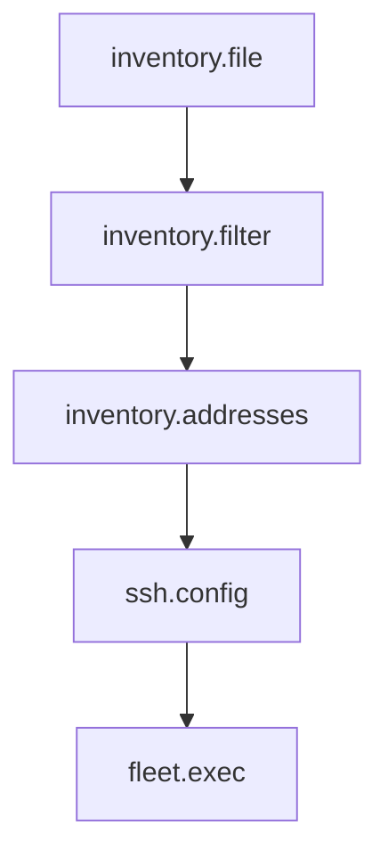

# Orchestrating fleets

For large-scale infrastructure operations, managing hosts individually becomes impractical. Starkite combines the `inventory` module with the concurrent execution model of the `ssh` module to let you discover, filter, and automate changes across entire server fleets.

## The Fleet Automation Workflow

Fleet automation in Starkite follows a three-step pattern:
1. **Load**: Load host metadata from structured configuration files (such as YAML or JSON) using `inventory.file()`.
2. **Filter**: Query and filter hosts based on attributes like environment, region, role, or resource capacity.
3. **Execute**: Extract target host addresses and dispatch commands or file transfers concurrently.



## Step 1: Defining the Host Inventory

Create a structured file (e.g., `fleet.yaml`) containing your infrastructure metadata. The `inventory` module expects a list of dictionaries, where each entry represents a host and its attributes:

```yaml
# fleet.yaml
- name: web-prod-1
  address: 192.168.10.11
  env: production
  role: web
  region: us-east
  cpu: 8
- name: web-prod-2
  address: 192.168.10.12
  env: production
  role: web
  region: us-east
  cpu: 8
- name: web-stage-1
  address: 192.168.20.11
  env: staging
  role: web
  region: us-west
  cpu: 4
- name: db-prod-1
  address: 192.168.10.21
  env: production
  role: database
  region: us-east
  cpu: 16
```

## Step 2: Loading and Filtering Hosts

Use the `inventory` module to load and query the fleet data. You can filter hosts using direct keyword arguments or custom predicate functions.

```python
def load_fleet():
    # Load all hosts from the inventory file
    fleet = inventory.file("fleet.yaml")
    print("Loaded", fleet.count, "total hosts")

    # Filter by exact attribute match
    prod_web = inventory.filter(fleet, env="production", role="web")
    print("Production web servers:", prod_web.count)

    # Filter using a predicate function (e.g., hosts with at least 8 CPUs)
    large_nodes = inventory.filter(fleet, func=lambda h: h.get("cpu", 0) >= 8)
    for host in large_nodes.items:
        print(host["name"], "cpus:", host["cpu"])
```

## Step 3: Concurrent Fleet Execution

Once you have filtered the desired subset of hosts, extract their network addresses using `inventory.addresses()` and pass them to the SSH client to dispatch commands concurrently.

```python
def deploy_fleet_patch():
    # 1. Load and filter the target fleet
    fleet_data = inventory.file("fleet.yaml")
    target_hosts = inventory.filter(fleet_data, env="production", role="web")
    
    # 2. Extract network addresses
    addresses = inventory.addresses(target_hosts, key="address")
    
    # 3. Configure the concurrent SSH client
    client = ssh.config(
        hosts = addresses,
        user  = "alice",
        key   = "~/.ssh/id_ed25519",
        timeout = "15s",
    )
    
    # 4. Dispatch the command concurrently across the fleet
    results = client.exec("uptime -p")
    
    # 5. Process and display results in a table
    t = table.new(["HOST", "STATUS", "OUTPUT"])
    for r in results:
        status = "OK" if r.ok else "FAIL"
        output = r.stdout.strip() if r.ok else r.stderr[:60]
        t.add_row(r.host, status, output)
    
    print(t.render())
```

## Managing Execution Strategies

By default, the SSH client executes commands concurrently across all hosts. If you need to limit execution rate or run commands sequentially (e.g., to perform rolling updates), set the `exec_policy` parameter in `ssh.config()`:

* **`concurrent` (default)**: Dispatches commands to all hosts in parallel.
* **`linear`**: Executes commands on one host at a time, halting if any host fails.

```python
def rolling_update():
    fleet_data = inventory.file("fleet.yaml")
    addresses = inventory.addresses(fleet_data)
    
    # Configure client to run commands sequentially
    client = ssh.config(
        hosts = addresses,
        user  = "alice",
        key   = "~/.ssh/id_ed25519",
        exec_policy = "linear",
    )
    
    # Will stop at the first failing host to prevent spreading issues
    results = client.exec("systemctl restart alice-app")
```
